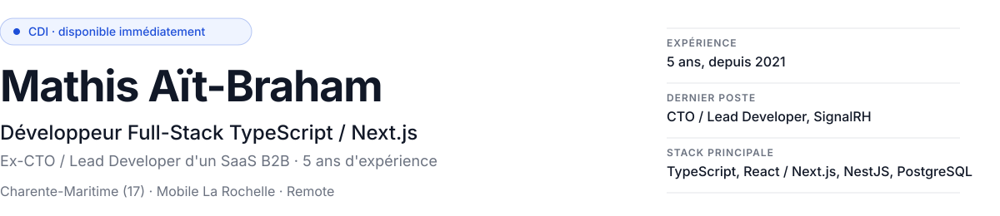
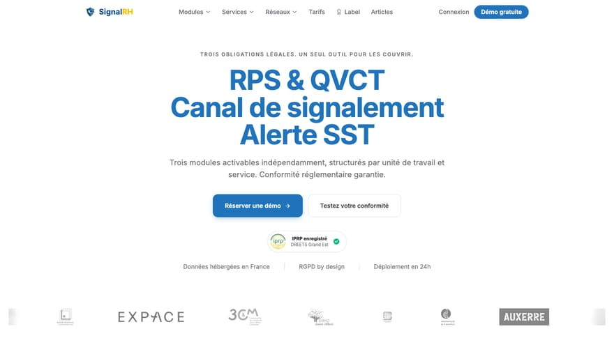
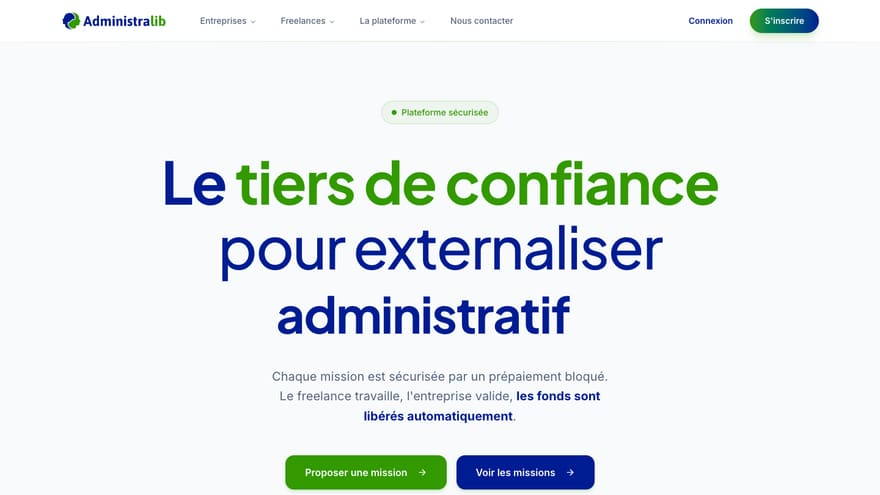
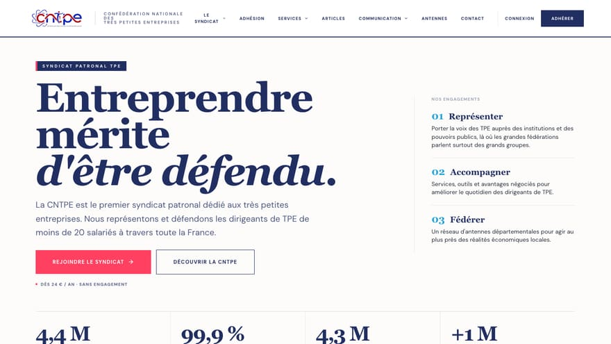
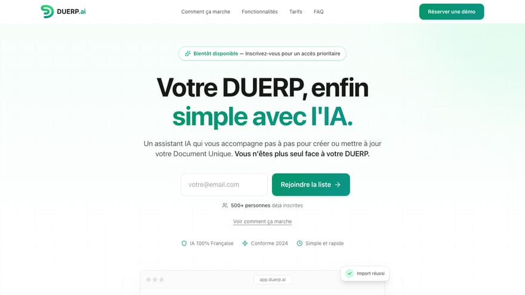
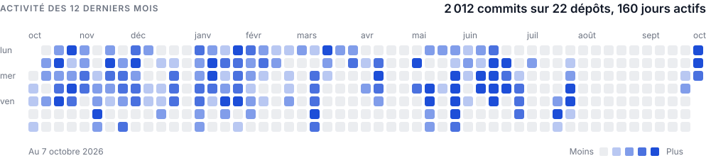

<picture>
  <source media="(prefers-color-scheme: dark)" srcset="./assets/header-dark.svg">
  
</picture>

[CV en ligne](https://www.mathis-aitbraham.fr) · [CV en PDF](https://www.mathis-aitbraham.fr/cv-mathis-ait-braham.pdf) · [LinkedIn](https://www.linkedin.com/in/mathis-aitbraham/) · [mathis.abhm@gmail.com](mailto:mathis.abhm@gmail.com)

Développeur full-stack depuis 2021, j'ai conçu et fait tourner en production des SaaS B2B de bout en bout : architecture, backend, frontend, paiements Stripe, déploiement Docker. Ancien CTO de SignalRH, j'ai l'habitude de travailler directement sur les enjeux produit et business, pas seulement sur les tickets. Stack principale : TypeScript, React / Next.js, Node (NestJS), PostgreSQL, avec un passé solide en PHP Symfony / Laravel.

## Ce que j'ai livré

<table>
<tr>
<td width="50%" valign="top">

 <b><a href="https://signalrh.fr">SignalRH</a></b> · 2025 → 2026
 SaaS RH de prévention des risques psychosociaux
 <b>+5 000</b> salariés onboardés automatiquement
</td>
<td width="50%" valign="top">

 <b><a href="https://administralib.fr">Administralib</a></b> · oct. 2025 → 2026
 Marketplace B2B entre entreprises et freelances administratifs
 <b>+200</b> transactions par mois
</td>
</tr>
<tr>
<td width="50%" valign="top">

 <b><a href="https://preprod.cntpe.org">CNTPE</a></b> · févr. 2026 → mai 2026
 Site et portail adhérents d'un syndicat patronal de TPE
 En préproduction
</td>
<td width="50%" valign="top">

 <b><a href="https://duerp.ai">DUERP.ai et La Forge</a></b> · mars 2026 → août 2026
 SaaS d'aide à la rédaction du Document Unique (DUERP) pour les TPE, bâti sur un template SaaS maison
 Bientôt disponible
</td>
</tr>
</table>

La plupart de ces dépôts sont privés (code d'entreprises et de clients). Le détail des projets est sur le [CV en ligne](https://www.mathis-aitbraham.fr).

## Activité

<picture>
  <source media="(prefers-color-scheme: dark)" srcset="./assets/activity-dark.svg">
  
</picture>

Comptés dans tous mes dépôts GitHub, personnels et clients, y compris les commits que GitHub ne rattache pas à mon profil.

## Stack

**Backend** : TypeScript · Node.js · NestJS · tRPC · PHP · Symfony · Laravel · APIs REST  
**Frontend** : React · Next.js · TanStack (Router, Query, Form, Table) · Tailwind CSS · React Native · Astro  
**Données et infra** : PostgreSQL · Prisma · MySQL · Redis · Docker · Docker Compose · Coolify · CI/CD GitHub Actions  
**Produit et SaaS** : Architecture multi-tenant · Stripe (abonnements, Connect, séquestre) · Better Auth / NextAuth · Emails transactionnels (Resend) · Jobs asynchrones (BullMQ, Trigger.dev) · Intégration de LLM  
**Qualité et outils** : Biome · Vitest · Jest · Playwright · Sentry · Git · GitHub · GitLab · Claude Code et agents

Ce README est généré depuis les données de mon CV.
